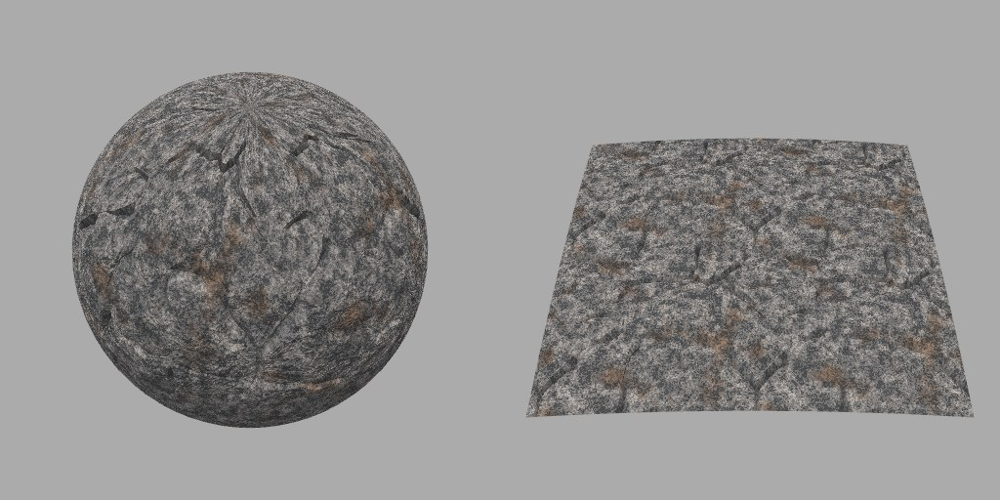
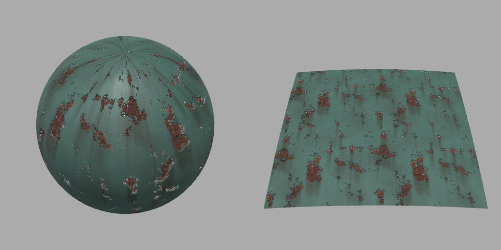
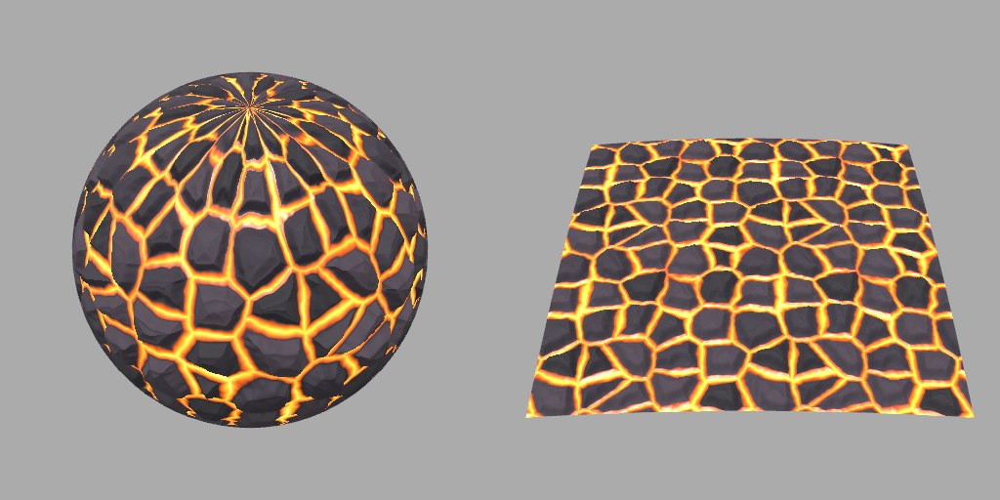
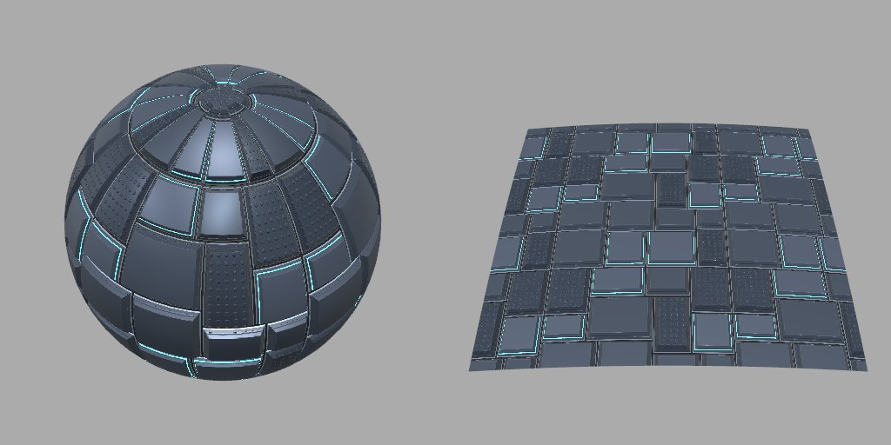
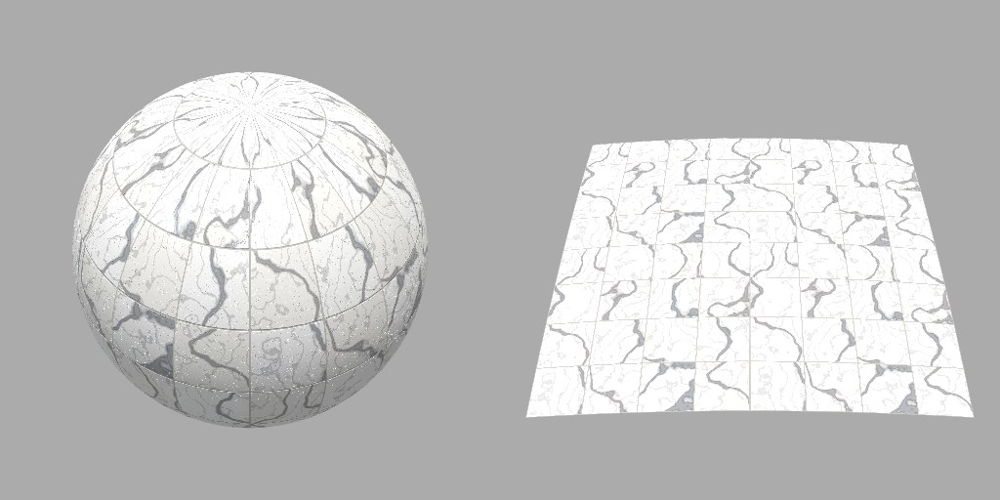
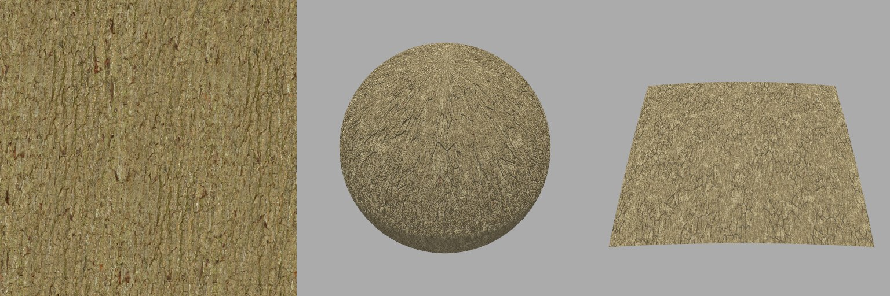
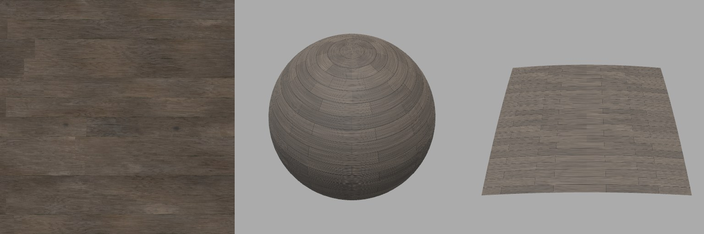

# Material Maker for AI agents (fork, branch `agent`)

This branch of [acceleroto/material-maker](https://github.com/acceleroto/material-maker/tree/agent) turns
[Material Maker](https://github.com/RodZill4/material-maker) into a tool **AI coding agents can drive**:
describe a material in words (or give a reference photo), and an agent such as Claude Code or Codex builds the
procedural graph, **looks at a lit 3D render of its own result**, iterates until it matches, and **delivers the
material into a Unity project**. The output stays a real Material Maker `.ptex` graph you can open and keep
editing in Material Maker.

| Granite cliff | Chipped paint metal | Stylized lava | Sci-fi floor panels |
|---|---|---|---|
|  |  |  |  |
| **Carrara marble tiles** | **Bark (photo match)** | **Wood planks (photo match)** | |
|  |  |  | |

*Made by an agent from one-line requests, 4–15 iterations each, all delivered into a Unity 6 URP project
(photo matches show the reference photo on the left). Write-up: [agent_docs/ACCEPTANCE.md](agent_docs/ACCEPTANCE.md).*

### Point your agent at it

> Clone `https://github.com/acceleroto/material-maker` (branch `agent`), follow
> `agent_docs/GETTING_STARTED.md` to install it, then make me a weathered red roof-tile material
> and put it in my Unity project at `~/Projects/MyGame`.

Setup is one command after cloning (needs macOS, [Godot 4.7](https://godotengine.org/download), Python 3.11+,
a desktop session; Unity optional):

```bash
git clone -b agent https://github.com/acceleroto/material-maker.git
cd material-maker
python3 agent_tools/setup.py
```

Then start Claude Code in the repo root (the MCP tools and the `material-maker` skill load automatically), or
register the MCP server with Codex or any MCP client. Full guide:
**[agent_docs/GETTING_STARTED.md](agent_docs/GETTING_STARTED.md)**.

### What this fork adds

- **MCP server** (`agent_tools/mcp_server.py`): 16 tools to load, edit, validate, render and export a graph in a
  persistent engine; renders come back as images (about 0.2–0.5 s per edit + preview).
- **Lit 3D preview** from the command line: Material Maker's own preview scene (sphere + plane, studio
  lighting), so agents judge materials the way a person would, not from flat texture maps.
- **`mmx` CLI** (`agent_tools/mmx.py`): validate (incl. shader compile), export with real exit codes and JSON,
  per-iteration contact sheets, per-node debug renders, reference-photo palette matching.
- **Unity hand-off**: `mmx to-unity` writes a `.mat` for the project's pipeline (URP/HDRP/Built-in) with correct
  texture import settings, keeps GUIDs on re-export, and can verify the result in Unity batchmode.
- **Agent instructions**: a Claude Code skill (`.claude/skills/material-maker/SKILL.md`) and
  [`AGENTS.md`](AGENTS.md) with the iteration loop, photo matching and many Material Maker pitfalls.
- **Engine fixes** for scripted use: `--size` honoured on export, exit codes, strict targets, no hangs on
  hidden windows. Changes to upstream files are kept minimal; upstream is merged regularly.

More: [how it fits together](agent_docs/ARCHITECTURE.md) · [all tools](agent_tools/README.md) ·
[example graphs](agent_docs/EXAMPLES.md) · [node reference](agent_docs/NODES.md) · [build log](agent_docs/PROGRESS.md).
Status: tested on macOS (Apple Silicon) with Godot 4.7 and Unity 6000.5; Linux/Windows untested. Same MIT
license as Material Maker. This fork is not affiliated with the Material Maker project; please don't send
upstream bug reports about agent features.

---

*The original Material Maker README follows.*

# Material Maker

This is a tool based on [Godot Engine](https://godotengine.org/) that can
be used to create textures procedurally and paint 3D models.

Its user interface is based on Godot's GraphEdit node: textures and brushes are
described as interconnected nodes.


## Download

- **[itch.io](https://rodzilla.itch.io/material-maker)**
- **[Steam](https://store.steampowered.com/app/4110830/Material_Maker/)**

On Windows, you can also install Material Maker using [Scoop](https://scoop.sh):

```text
scoop bucket add extras
scoop install material-maker
```
... or [Chocolatey](https://chocolatey.org/) (default or portable install):
```text
choco install material-maker
```
```text
choco install material-maker.portable
```

on macOS, you can also install Material Maker using [Homebrew](https://brew.sh/):

```text
brew install material-maker
```

Can't wait for next release? Automated builds from master branch are available (use at your own risk):

[](https://github.com/RodZill4/material-maker/actions/workflows/dev-desktop-builds.yml?query=branch%3Amaster)

## Documentation

- **[User manual](https://rodzill4.github.io/material-maker/doc/)**

## Translations

Translation files can be installed using the **Install** button in the **Preferences** dialog.

- [Chinese translation](https://raw.githubusercontent.com/RodZill4/material-maker/f1be50b21a0f4991ac39e12a5362f5c5eb4c83a0/material_maker/locale/translations/zh.csv) (Created by **free_king**)

## Community

- **[Discord server](https://discord.gg/PF5V3mFwFM)**
- **[Material Maker subreddit](https://www.reddit.com/r/MaterialMaker/)**

## License

Copyright (c) 2018-present Rodolphe Suescun and contributors

Unless otherwise specified, files in this repository are licensed under the
MIT license. See [LICENSE.md](LICENSE.md) for more information.
